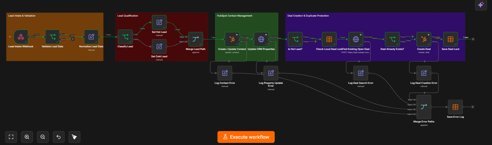

# HubSpot Lead-to-Deal Automation

Automatyzacja procesu lead-to-deal zbudowana w n8n i zintegrowana z HubSpot CRM.

## Workflow overview



Workflow przyjmuje leady przez webhook, waliduje i normalizuje dane, klasyfikuje leady jako Hot lub Cold, synchronizuje kontakty z HubSpotem, tworzy transakcje dla zakwalifikowanych leadów, zapobiega duplikatom oraz zapisuje błędy integracji.

---

## Opis projektu

Celem projektu było zbudowanie praktycznej automatyzacji procesu obsługi leadów od momentu ich wejścia do systemu aż do utworzenia transakcji w HubSpot CRM.

Projekt pokazuje wykorzystanie kilku typowych wzorców automatyzacji:

- walidacja danych wejściowych
- normalizacja danych
- kwalifikacja leadów
- synchronizacja z CRM
- integracja przez API
- ochrona przed duplikatami
- idempotencja
- obsługa błędów
- logowanie błędów integracji

---

## Jak działa workflow

Proces został podzielony na cztery główne etapy.

### 1. Lead Intake & Validation

Workflow:

- odbiera dane leada przez webhook
- sprawdza poprawność adresu email
- sprawdza poprawność budżetu
- sprawdza źródło leada
- zatrzymuje niepoprawne dane przed wysłaniem ich do HubSpot

### 2. Lead Qualification

Po przejściu walidacji dane są normalizowane.

Workflow:

- przygotowuje dane do dalszego przetwarzania
- mapuje `Facebook Ads` na `Meta Ads`
- klasyfikuje lead na podstawie budżetu
- przypisuje status `Hot Lead` lub `Cold Lead`

### 3. HubSpot Contact Management

Kontakt jest następnie synchronizowany z HubSpot CRM.

Workflow:

- tworzy nowy kontakt lub aktualizuje istniejący
- aktualizuje dodatkowe właściwości CRM
- zapisuje temperaturę leada
- zapisuje budżet
- zapisuje źródło pozyskania

### 4. Deal Creation & Duplicate Protection

Dalsza część procesu wykonywana jest tylko dla Hot Leadów.

Workflow:

- sprawdza lokalną tabelę idempotencji
- wyszukuje istniejącą otwartą transakcję w HubSpot
- tworzy nowy Deal tylko wtedy, gdy nie istnieje już aktywna transakcja
- po poprawnym utworzeniu zapisuje lokalny Deal Lock

---

## Ochrona przed duplikatami

Workflow wykorzystuje dwa poziomy ochrony przed ponownym utworzeniem tej samej transakcji:

1. lokalną tabelę n8n Data Table
2. wyszukiwanie istniejącej otwartej transakcji przez HubSpot CRM API

Dzięki temu ponowne wysłanie tego samego leada nie powoduje utworzenia kolejnego Deala.

---

## Obsługa błędów

Nody odpowiedzialne za komunikację z HubSpot posiadają osobne ścieżki błędów.

Obsługiwane są błędy między innymi podczas:

- tworzenia lub aktualizacji kontaktu
- aktualizacji właściwości CRM
- wyszukiwania istniejącej transakcji
- tworzenia nowego Deala

Każdy błąd jest normalizowany i zapisywany w tabeli `workflow_errors`.

Zapisywane informacje:

- etap workflow
- email leada
- treść błędu
- timestamp

---

## Przykładowy input

```json
{
  "firstName": "Natalia",
  "lastName": "Wronska",
  "email": "natalia.wronska@example.com",
  "phone": "+48123456789",
  "company": "Example Company",
  "budget": 18500,
  "source": "Facebook Ads"
}
